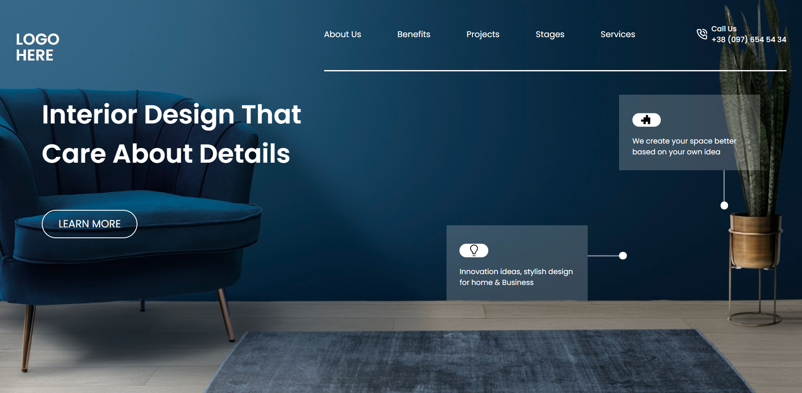

# Interior Design Landing Page

## :link: [See it live](https://fullstack-js-bc-project-10.netlify.app/)

## :clipboard: Learning Outcomes 

- Positioning and sizing of background image
- More complex use of CSS absolute and relative positioning

## :camera: Screenshot

